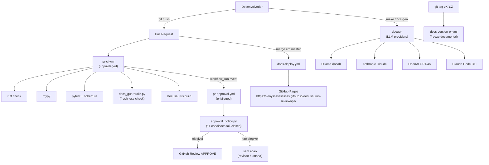
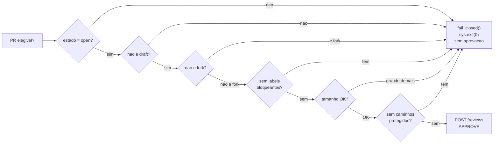
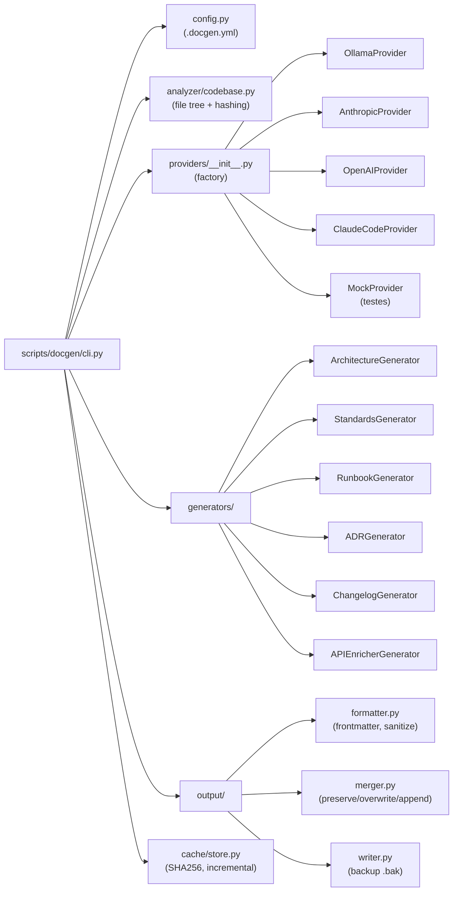

# Architecture Overview

O **docusaurus-reviewops** e um sistema de governanca de Pull Requests combinado com um portal de documentacao viva. Ele opera como uma camada de automacao sobre qualquer repositorio GitHub, sem exigir alteracoes no codigo de producao.

## Visao geral do sistema



## Separacao de privilegios (security model)

O principio de seguranca central e a **separacao de privilegios entre workflows**:

| Workflow | Trigger | Permissoes | Faz checkout do PR? |
|----------|---------|-----------|---------------------|
| `pr-ci.yml` | `pull_request` | `contents: read` | Sim — sem write |
| `pr-approval.yml` | `workflow_run` | `pull-requests: write` | **Nao** — so API REST |
| `docs-deploy.yml` | `push (master)` | `pages: write` | Sim — codigo de confianca |
| `docs-version-pr.yml` | `push (tag v*)` | `contents: write`, `pull-requests: write` | Sim — codigo de confianca |

:::danger Regra inviolavel

O workflow `pr-approval.yml` **nunca executa codigo do PR**. Ele e disparado por `workflow_run`
(apos o CI concluir) e apenas consome metadados via API REST do GitHub. Isso elimina a classe
de ataques onde um PR malicioso modifica workflows para escalar permissoes.

Referencia: [GitHub Security Lab — Preventing pwn requests](https://securitylab.github.com/research/github-actions-preventing-pwn-requests/)

:::

## Componentes principais

### 1. approval_policy.py

A logica de auto-aprovacao. Opera em modo **fail-closed**: qualquer condicao nao satisfeita
resulta em ausencia de aprovacao (nao em erro — a ausencia de aprovacao e o comportamento
correto).

11 condicoes de rejeicao avaliadas em sequencia:
1. PR nao esta `open`
2. PR e `draft`
3. PR vem de um fork
4. Labels bloqueantes presentes: `security`, `breaking-change`, `db-migration`, `infra-change`, `needs-human-review`
5. Mais de 30 arquivos alterados
6. Mais de 800 linhas de delta total
7. Toca caminhos protegidos: `.github/`, `infra/`, `terraform/`, `helm/`, `migrations/`, `alembic/`, lockfiles, config do portal
8. Review `CHANGES_REQUESTED` pendente
9. Bot ja aprovou (evita duplicata)
10. Resposta inesperada da API
11. Qualquer excecao nao tratada



### 2. docs_guardrails.py

Verifica se mudancas em codigo publico sao acompanhadas de atualizacao de documentacao.

**Politica diferenciada por tamanho:**
- **PRs pequenos** (≤ 3 arquivos publicos): qualquer doc touch satisfaz (README, CHANGELOG, docs-site/docs/)
- **PRs grandes** (> 3 arquivos publicos): exige ao menos 1 arquivo em `docs-site/docs/` ou `docs/`
  — CHANGELOG.md sozinho nao e suficiente (previne bypass trivial)

### 3. Sistema docgen

Gerador de documentacao via LLM com arquitetura plugavel de providers:



### 4. Portal Docusaurus

Estrutura do portal publicado em [venysssssssssss.github.io/docusaurus-reviewops](https://venysssssssssss.github.io/docusaurus-reviewops/):

| Secao | Path | Conteudo |
|-------|------|----------|
| Home | `/` | Index com overview e quickstart |
| Architecture | `/architecture/overview` | Esta pagina |
| Standards | `/standards/coding-standards` | Convencoes de codigo e qualidade |
| Runbooks | `/runbooks/deploy` | Procedimentos operacionais |
| ADR | `/adr/001-docusaurus-reviewops` | Registro de decisoes arquiteturais |
| API Reference | `/api/` | Auto-gerada via OpenAPI schema |

## Estrutura de diretorios

```text
docusaurus-reviewops/
├── .github/
│   ├── scripts/
│   │   ├── approval_policy.py   # logica de aprovacao (fail-closed)
│   │   └── docs_guardrails.py   # freshness check de documentacao
│   ├── workflows/
│   │   ├── pr-ci.yml            # quality gates (nao privilegiado)
│   │   ├── pr-approval.yml      # aprovacao (privilegiado, sem checkout)
│   │   ├── docs-deploy.yml      # deploy GitHub Pages
│   │   └── docs-version-pr.yml  # freeze documental em releases
│   ├── ISSUE_TEMPLATE/          # templates de issue
│   ├── CODEOWNERS               # regras de revisao
│   ├── dependabot.yml           # atualizacao automatica de deps
│   ├── labels.yml               # labels operacionais
│   └── PULL_REQUEST_TEMPLATE.md # template de PR
├── docs-site/                   # portal Docusaurus v3.9.2
│   ├── docs/                    # conteudo Markdown curado
│   ├── src/theme/               # swizzle de componentes (ESM-only)
│   ├── openapi/                 # schema OpenAPI exportado
│   └── docusaurus.config.ts     # configuracao do portal
├── scripts/
│   ├── docgen/                  # sistema de geracao via LLM
│   ├── export_openapi.py        # exporta schema FastAPI
│   └── validate_config.py       # verifica prontidao para deploy
└── tests/                       # testes unitarios (182+ testes)
```

## Decisoes arquiteturais

Veja os [ADRs](/adr/001-docusaurus-reviewops) para o historico completo de decisoes com contexto e rationale.

## Veja tambem

- [ADR-001: Adocao do docusaurus-reviewops](/adr/001-docusaurus-reviewops)
- [Coding Standards](/standards/coding-standards)
- [Deploy Runbook](/runbooks/deploy)
- [API Reference](/api/core/api)
