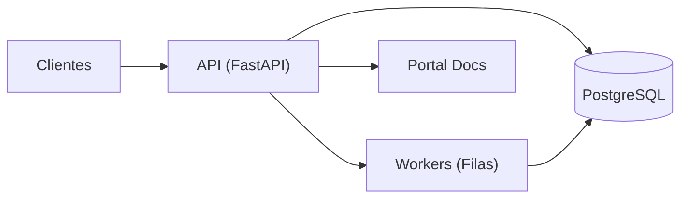
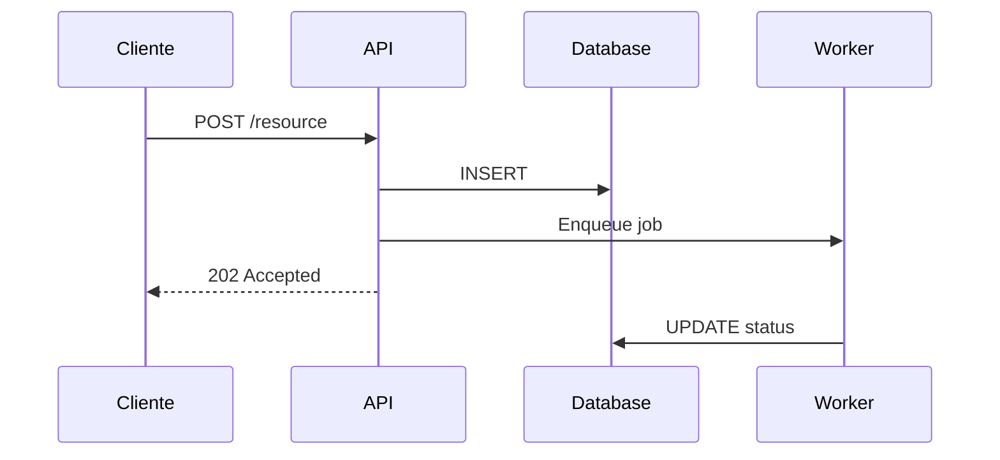

# Architecture Overview

:::warning Conteudo de exemplo

Esta pagina usa uma arquitetura exemplo. Substitua pelo sistema real do seu projeto.

:::

## Diagrama do sistema

## Componentes

| Componente | Responsabilidade | Stack |
|---|---|---|
| API | Endpoints HTTP, autenticacao, validacao | FastAPI, Pydantic |
| Workers | Processamento assincrono | Celery / ARQ |
| Database | Persistencia, queries | PostgreSQL |
| Portal Docs | Documentacao viva | Docusaurus v3 |

## Fluxo de dados

1. Cliente envia request para a API
2. API valida, processa e persiste no banco
3. Se necessario, enfileira job para worker
4. Worker processa e atualiza resultado no banco

## Decisoes arquiteturais

Veja os [ADRs](/adr/001-docusaurus-reviewops) para o historico completo de decisoes com contexto e rationale.

## Como editar esta pagina

Esta pagina vive em `docs-site/docs/architecture/overview.md`.
Abra um PR e o CI validara o build automaticamente.

## Veja tambem

- [ADR-001: Adocao do docusaurus-reviewops](/adr/001-docusaurus-reviewops)
- [Coding Standards](/standards/coding-standards)
- [API Reference](/api/core/api)
