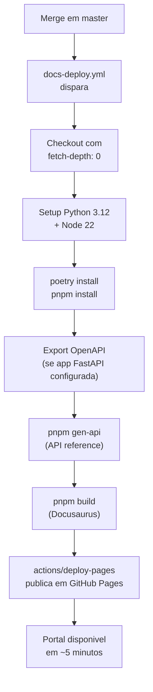
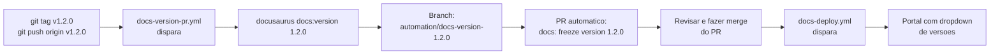

# Deploy Runbook

Portal publicado em: **[venysssssssssss.github.io/docusaurus-reviewops](https://venysssssssssss.github.io/docusaurus-reviewops/)**

## Setup inicial (primeira vez)

Antes do primeiro deploy automatico funcionar, o GitHub Pages precisa ser habilitado manualmente.

:::warning Obrigatorio no primeiro uso

Este passo e feito uma vez e nao precisa ser repetido.

:::

### 1. Habilitar GitHub Pages

```
GitHub > Settings > Pages
  Source: GitHub Actions (nao "Deploy from a branch")
```

### 2. Conceder permissoes para o workflow

```
GitHub > Settings > Actions > General > Workflow permissions
  [x] Read and write permissions
  [x] Allow GitHub Actions to create and approve pull requests
```

### 3. Verificar branch protection

```
GitHub > Settings > Branches > Add branch protection rule
  Branch name pattern: master
  [x] Require status checks to pass before merging
      Status checks: quality-gates, docs-gates
  [x] Require conversation resolution
  [x] Block direct pushes
```

### 4. Criar labels operacionais

```bash
gh label import .github/labels.yml
```

### 5. Primeiro deploy

```bash
git push origin master
# O workflow docs-deploy.yml dispara automaticamente
# Aguarde ~5 minutos e acesse a URL do portal
```

## Deploy automatico (operacao normal)

Todo merge em `master` dispara deploy automaticamente:



:::tip Tempo de deploy

Tempo medio: **3 a 5 minutos** do merge ate publicacao. O tempo pode ser maior na primeira vez (cache frio das dependencias Node.js).

:::

### Verificacao pos-deploy

1. Acesse [venysssssssssss.github.io/docusaurus-reviewops](https://venysssssssssss.github.io/docusaurus-reviewops/)
2. Verifique se as paginas modificadas estao atualizadas
3. Confirme que "Last updated" no rodape de cada pagina reflete o merge recente
4. Verifique o job `Docs Deploy` em **Actions** para confirmar sucesso

## Release e congelamento de docs

Para congelar a documentacao junto com uma release de produto:



```bash title="Criar e publicar tag de release"
# 1. Crie e publique a tag
git tag v1.2.0
git push origin v1.2.0

# 2. O workflow cria automaticamente:
#    - Branch: automation/docs-version-1.2.0
#    - PR: "docs: freeze version 1.2.0"

# 3. Revise e faca merge do PR para publicar com versao congelada
```

:::info Primeira versao congelada

Apos o primeiro freeze, **descomente o bloco de versionamento** em `docs-site/docusaurus.config.ts`.
Procure o comentario `// Versioning — descomente apos criar a primeira versao:`.

:::

## Rollback

:::danger Procedimento de emergencia

Use rollback apenas quando o portal esta com problemas graves que afetam usuarios e o problema nao pode ser resolvido por um novo deploy.

:::

### Via revert (preferido)

O git revert cria um novo commit que desfaz as mudancas, mantendo o historico integro.

```bash title="Rollback via git revert"
# Encontre o SHA do commit problematico
git log --oneline -10

# Crie um revert commit
git revert <sha-do-commit-problematico>
git push origin master

# O CI vai rodar e, se passar, docs-deploy.yml fara o deploy da versao revertida
```

### Via re-deploy de tag anterior

Se o portal esta com problemas graves e o revert demora, re-publique manualmente:

```bash title="Rollback via tag anterior"
# Identifique a tag estavel anterior
git tag --sort=-version:refname | head -5

# Checkout da tag
git checkout v1.1.0

# Build e upload manual
pnpm --dir docs-site install
pnpm --dir docs-site build
# Faca upload do docs-site/build/ via GitHub Pages manualmente
# ou via gh pages deploy:
# gh-pages -d docs-site/build -b gh-pages
```

## Troubleshooting

| Problema | Causa provavel | Diagnostico | Solucao |
|----------|---------------|-------------|---------|
| Build falha no CI | Link quebrado ou erro de sintaxe Markdown | Log do job `docs-gates` > "Build docs site" | Corrija o link ou sintaxe e abra novo PR |
| Portal nao atualiza apos merge | Deploy enfileirado ou falhou silenciosamente | Actions > Docs Deploy > verificar run | Re-execute o workflow manualmente |
| API reference vazia ou com erro | `export_openapi.py` nao configurado | Log do job `docs-gates` > "Export OpenAPI schema" | Aponte para sua app FastAPI em `scripts/export_openapi.py` |
| Versao nao aparece no dropdown | Bloco de versionamento comentado | `docs-site/docusaurus.config.ts` | Descomente o bloco de versioning apos o primeiro freeze |
| GitHub Pages retorna 404 | Pages nao foi habilitado ou branch errado | Settings > Pages | Configure `Source: GitHub Actions` |
| `pnpm install --frozen-lockfile` falha | lockfile desatualizado apos bump de deps | Log do CI | Rode `pnpm --dir docs-site install` localmente e commite o `pnpm-lock.yaml` atualizado |

## Monitoramento

| O que monitorar | Onde verificar |
|----------------|---------------|
| Status do portal | [venysssssssssss.github.io/docusaurus-reviewops](https://venysssssssssss.github.io/docusaurus-reviewops/) |
| Ultimo deploy | [Actions > Docs Deploy](https://github.com/venysssssssssss/docusaurus-reviewops/actions/workflows/docs-deploy.yml) |
| PR CI | [Actions > Pull Request CI](https://github.com/venysssssssssss/docusaurus-reviewops/actions/workflows/pr-ci.yml) |
| Dependencias desatualizadas | [Pull Requests > Dependabot](https://github.com/venysssssssssss/docusaurus-reviewops/pulls?q=is%3Apr+author%3Aapp%2Fdependabot) |

## Veja tambem

- [Architecture Overview](/architecture/overview)
- [ADR-001: docusaurus-reviewops](/adr/001-docusaurus-reviewops)
- [Coding Standards](/standards/coding-standards)
