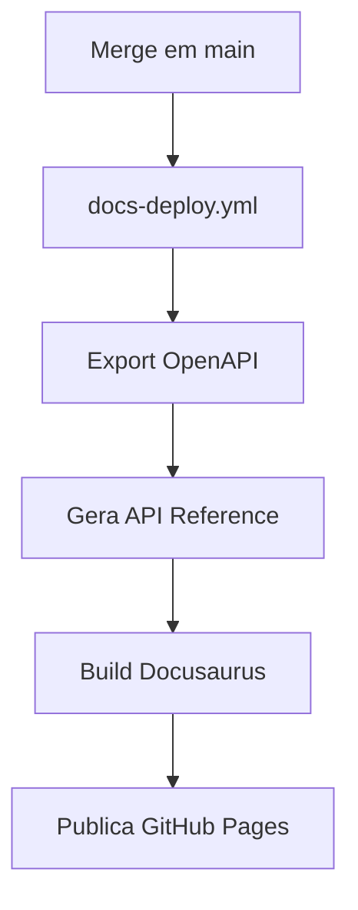

# Deploy Runbook

## Deploy automatico (padrao)

Todo merge em `main` dispara deploy automaticamente:



:::tip Tempo de deploy

Tempo medio: **< 5 minutos** do merge ate publicacao.

:::

### Verificacao pos-deploy

1. Acesse a URL do portal
2. Verifique se as paginas modificadas estao atualizadas
3. Confirme que "Last updated" reflete o merge recente

## Release e congelamento de docs

Para congelar a documentacao junto com uma release:

```bash title="Criar e publicar tag de release"
# 1. Crie e publique a tag
git tag v1.2.0
git push origin v1.2.0

# 2. O workflow cria automaticamente:
#    - Branch: automation/docs-version-1.2.0
#    - PR: "docs: freeze version 1.2.0"

# 3. Revise e faca merge do PR
```

Apos o primeiro freeze, descomente o bloco de versionamento em `docusaurus.config.ts`.

## Rollback

:::danger Procedimento de emergencia

Use rollback apenas quando o portal esta com problemas graves que afetam usuarios.

:::

### Via revert (preferido)

```bash title="Rollback via git revert"
git revert <sha-do-commit-problematico>
git push origin main
# CI faz deploy automaticamente da versao revertida
```

### Via tag anterior

Se o portal esta com problemas graves, re-publique a versao anterior:

```bash title="Rollback via tag"
git checkout v1.1.0
pnpm --dir docs-site install && pnpm --dir docs-site build
# Upload manual via GitHub Pages ou re-deploy
```

## Troubleshooting

| Problema | Causa provavel | Solucao |
|---|---|---|
| Build falha no CI | Link quebrado ou erro de sintaxe | Verifique o log do job `docs-gates` |
| Portal nao atualiza | Deploy esta enfileirado | Verifique Actions > Docs Deploy |
| API reference vazia | `export_openapi.py` nao configurado | Aponte para sua app FastAPI |
| Versao nao aparece | Dropdown desativado | Descomente bloco em `docusaurus.config.ts` |

## Veja tambem

- [Architecture Overview](/architecture/overview)
- [ADR-001: docusaurus-reviewops](/adr/001-docusaurus-reviewops)
