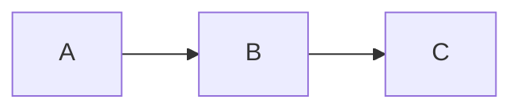

# Contributing

## Setup

```bash
make setup    # Python venv + pnpm install
```

## Development

```bash
make docs-dev   # Sobe servidor local em localhost:3000
make test       # Roda lint + testes
make all        # lint + typecheck + test + build
```

## Writing Documentation

All documentation lives in `docs-site/docs/`. Follow these conventions:

### Frontmatter

Every `.md` file must include:

```yaml
---
id: my-page
title: Page Title
sidebar_label: Short Label
sidebar_position: 1
description: "One-sentence summary for SEO and previews."
keywords: [keyword1, keyword2, keyword3]
---
```

### Admonitions

Use admonitions for callouts:

```markdown
:::tip Title
Helpful tips or shortcuts.
:::

:::warning Title
Important caveats or gotchas.
:::

:::danger Title
Security-critical or destructive information.
:::

:::info Title
General informational notes.
:::
```

### Diagrams

Use Mermaid for diagrams (no image files):

````markdown

````

### Code Blocks

Always add a title:

````markdown
```bash title="Install dependencies"
make setup
```
````

### Cross-links

Every doc should end with a "Veja tambem" section:

```markdown
## Veja tambem

- [Related Page 1](/path/to/page)
- [Related Page 2](/path/to/page)
```

### Category Ordering

Each directory under `docs/` must have a `_category_.json`:

```json
{
  "label": "Category Name",
  "position": 2,
  "link": {
    "type": "generated-index",
    "description": "Short description."
  }
}
```

## Pull Requests

- One topic per PR
- Include docs if behavior changed (enforced by CI)
- Title format: `type(scope): description` (Conventional Commits)
- PRs < 30 files and < 800 lines are auto-approvable

## Tests

```bash
make test   # runs pytest
```

Add tests for new theme overrides or config changes in `tests/test_docs_site_overrides.py`.

## Swizzling Theme Components

If you need to override an OpenAPI theme component:

1. Check if the upstream file uses CJS (`exports.default = ...`)
2. If yes, write a clean ESM re-implementation (don't just wrap it)
3. Place it in `docs-site/src/theme/<ComponentName>/index.js`
4. Add a test in `tests/test_docs_site_overrides.py`
5. Never import from `@theme/ApiExplorer/SecuritySchemes`, `Request`, `Response`, or `CodeSnippets`
