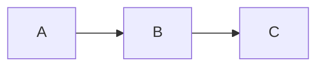

# Contributing

## Setup

```bash
make setup    # Python venv + pnpm install
```

Isso instala:
- `poetry install --with dev` — Python deps incluindo ruff, mypy, pytest, pytest-cov
- `pnpm --dir docs-site install` — deps Node do portal Docusaurus

### Variaveis de ambiente

```bash
cp .env.example .env
# Edite .env com chaves de API se quiser usar make docs-gen com providers na nuvem
```

Sem configuracao extra, o sistema funciona com Ollama local (gratuito).

### Hooks de pre-commit (recomendado)

```bash
poetry run pre-commit install
```

Os hooks rodam automaticamente em `git commit`:
- `ruff` — lint + format
- `detect-private-key` — previne commit acidental de secrets
- `no-commit-to-branch` — protege o branch `master` de commits diretos
- `mypy` — type checking

## Development

```bash
make docs-dev   # Sobe servidor local em localhost:3000
make test       # pytest (184 testes)
make coverage   # pytest + cobertura >= 80% (falha se abaixo)
make lint       # ruff check .
make typecheck  # mypy src .github/scripts scripts
make all        # lint + typecheck + test + docs build
```

### Geracao de docs via LLM

```bash
make docs-gen-preview   # Preview sem escrever nada
make docs-gen           # Gera e salva (default: Ollama local)

# Com provider especifico
DOCGEN_PROVIDER=anthropic make docs-gen
```

## Writing Documentation

All documentation lives in `docs-site/docs/`. Follow these conventions:

### Frontmatter

Every `.md` file must include:

```yaml
---
id: my-page
title: Page Title
sidebar_label: Short Label
sidebar_position: 1
description: "One-sentence summary for SEO and previews."
keywords: [keyword1, keyword2, keyword3]
---
```

### Admonitions

Use admonitions for callouts:

```markdown
:::tip Title
Helpful tips or shortcuts.
:::

:::warning Title
Important caveats or gotchas.
:::

:::danger Title
Security-critical or destructive information.
:::

:::info Title
General informational notes.
:::
```

### Diagrams

Use Mermaid for diagrams (no image files):

````markdown

````

### Code Blocks

Always add a title:

````markdown
```bash title="Install dependencies"
make setup
```
````

### Cross-links

Every doc should end with a "Veja tambem" section:

```markdown
## Veja tambem

- [Related Page 1](/path/to/page)
- [Related Page 2](/path/to/page)
```

### Category Ordering

Each directory under `docs/` must have a `_category_.json`:

```json
{
  "label": "Category Name",
  "position": 2,
  "link": {
    "type": "generated-index",
    "description": "Short description."
  }
}
```

## Pull Requests

- Use o template em `.github/PULL_REQUEST_TEMPLATE.md` — preencha todos os campos
- Um assunto por PR
- Inclua docs se o comportamento mudou (enforced pelo CI — `docs_guardrails.py`)
- Titulo: `tipo(escopo): descricao` (Conventional Commits)
- Limites para auto-aprovacao: < 30 arquivos, < 800 linhas delta total, < 400 net change
- PRs que tocam `.github/`, `infra/`, lockfiles ou configs do portal requerem revisao humana

## Tests

```bash
make test       # 184 testes
make coverage   # com gate de 80% de cobertura
```

Add tests for new theme overrides or config changes in `tests/test_docs_site_overrides.py`.

Para novos scripts Python, adicione testes em `tests/` seguindo o padrao de importacao dinamica
usado nos testes existentes (`importlib.util.spec_from_file_location`).

## Swizzling Theme Components

If you need to override an OpenAPI theme component:

1. Check if the upstream file uses CJS (`exports.default = ...`)
2. If yes, write a clean ESM re-implementation (don't just wrap it)
3. Place it in `docs-site/src/theme/<ComponentName>/index.js`
4. Add a test in `tests/test_docs_site_overrides.py`
5. Never import from `@theme/ApiExplorer/SecuritySchemes`, `Request`, `Response`, or `CodeSnippets`
