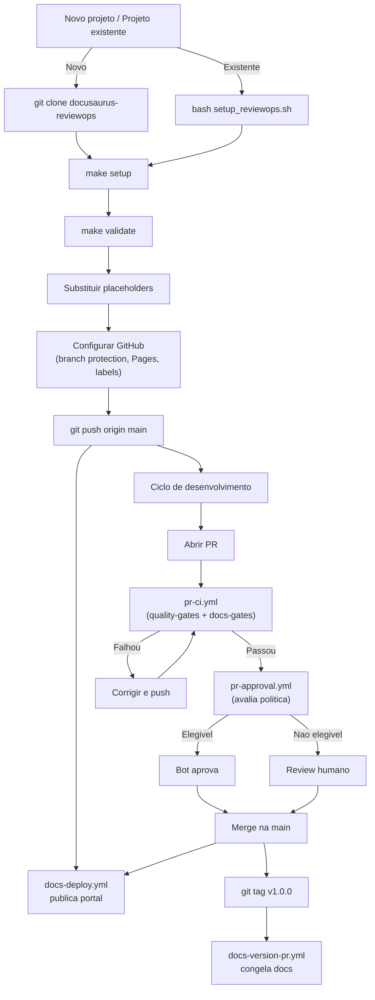

# Guia de Uso — docusaurus-reviewops

Guia completo para aplicar o docusaurus-reviewops em **projetos novos** e **projetos existentes**.

---

## Indice

1. [O que voce ganha](#o-que-voce-ganha)
2. [Pre-requisitos](#pre-requisitos)
3. [Projeto novo (do zero)](#projeto-novo-do-zero)
4. [Projeto existente](#projeto-existente)
5. [Configuracao do GitHub](#configuracao-do-github)
6. [Substituindo placeholders](#substituindo-placeholders)
7. [Conectando sua API (FastAPI)](#conectando-sua-api-fastapi)
8. [Primeiro deploy](#primeiro-deploy)
9. [Versionamento de docs](#versionamento-de-docs)
10. [Customizacao avancada](#customizacao-avancada)
11. [Troubleshooting](#troubleshooting)
12. [Referencia de comandos](#referencia-de-comandos)

---

## O que voce ganha

Ao aplicar este projeto, seu repositorio passa a ter:

| Recurso | Descricao |
|---------|-----------|
| **Quality gates** | Lint (ruff), tipos (mypy), testes (pytest) em todo PR |
| **Docs freshness** | CI falha se codigo publico mudou sem documentacao |
| **Auto-aprovacao** | PRs de baixo risco aprovados automaticamente |
| **Portal Docusaurus** | Publicado em GitHub Pages a cada merge no master |
| **API Reference** | Gerada automaticamente a partir do schema OpenAPI |
| **Versionamento** | Docs congelados em cada release (git tag) |
| **Busca local** | Ctrl+K para busca offline (sem Algolia) |
| **Diagramas** | Mermaid nativo em code blocks |

---

## Pre-requisitos

| Ferramenta | Versao minima | Verificar |
|------------|---------------|-----------|
| Python | 3.12+ | `python3 --version` |
| Node.js | 22+ | `node --version` |
| pnpm | 10+ | `pnpm --version` (ou `corepack enable`) |
| Poetry | 2.x | `poetry --version` (opcional, venv funciona) |
| Git | 2.x | `git --version` |
| GitHub CLI | 2.x | `gh --version` (opcional, para labels e PRs) |

---

## Projeto novo (do zero)

Para iniciar um projeto do zero usando docusaurus-reviewops como base.

### Passo 1 — Clone o repositorio

```bash title="Clone e renomeie"
git clone https://github.com/SEU-USER/docusaurus-reviewops.git meu-projeto
cd meu-projeto
```

Se preferir, faca um fork pelo GitHub e depois clone o fork.

### Passo 2 — Limpe a historia do git (opcional)

Se quiser comecar com uma historia limpa:

```bash title="Reset da historia"
rm -rf .git
git init
git add .
git commit -m "feat: initial setup from docusaurus-reviewops"
```

### Passo 3 — Instale dependencias

```bash title="Setup completo"
make setup
```

Isso executa:
1. `poetry install` (ou cria venv + pip install) para dependencias Python
2. `pnpm --dir docs-site install` para dependencias Node

Se `pnpm` nao estiver disponivel, ative com:

```bash title="Ativar pnpm via corepack"
corepack enable
```

### Passo 4 — Verifique placeholders

```bash title="Checar o que precisa ser substituido"
make validate
```

O script lista todos os placeholders pendentes. Veja [Substituindo placeholders](#substituindo-placeholders) para o passo a passo.

### Passo 5 — Rode os testes

```bash title="Lint + testes"
make test
```

Todos os 184 testes devem passar sem nenhuma alteracao.

### Passo 6 — Veja o portal localmente

```bash title="Servidor de desenvolvimento"
make docs-dev
```

Acesse `http://localhost:3000`. O portal ja vem com:
- Homepage com hero section
- 5 secoes de documentacao (Architecture, Standards, Runbooks, ADR, API)
- Busca local (Ctrl+K)
- Dark mode automatico (respeitaPrefersColorScheme)

### Passo 7 — Publique no GitHub

```bash title="Push para o GitHub"
git remote set-url origin https://github.com/SEU-ORG/SEU-REPO.git
git push -u origin master
```

Depois configure o GitHub conforme [Configuracao do GitHub](#configuracao-do-github).

---

## Projeto existente

Para adicionar docusaurus-reviewops a um repositorio que ja existe.

### Passo 1 — Clone o docusaurus-reviewops em um diretorio temporario

```bash title="Clone temporario"
git clone https://github.com/SEU-USER/docusaurus-reviewops.git /tmp/reviewops
```

### Passo 2 — Execute o script de instalacao

```bash title="Instalacao interativa"
cd /caminho/do/seu/projeto
bash /tmp/reviewops/scripts/setup_reviewops.sh
```

O script faz o seguinte automaticamente:
1. Detecta o que ja existe no seu projeto
2. **Nunca sobrescreve** arquivos existentes
3. Pergunta antes de cada acao (modo interativo)

#### Opcoes do script

```bash title="Modo dry-run (apenas mostra o que faria)"
bash /tmp/reviewops/scripts/setup_reviewops.sh --dry-run
```

```bash title="Aceitar tudo sem perguntar"
bash /tmp/reviewops/scripts/setup_reviewops.sh --yes
```

```bash title="Especificar diretorio alvo"
bash /tmp/reviewops/scripts/setup_reviewops.sh --target /outro/repo
```

```bash title="Combinar flags"
bash /tmp/reviewops/scripts/setup_reviewops.sh --dry-run --target /outro/repo
```

### Passo 3 — O que o script copia

| Origem | Destino | Condicao |
|--------|---------|----------|
| `.github/workflows/*.yml` | `.github/workflows/` | Copia se nao existir |
| `.github/scripts/*.py` | `.github/scripts/` | Copia se nao existir |
| `.github/CODEOWNERS` | `.github/CODEOWNERS` | Copia se nao existir |
| `.github/labels.yml` | `.github/labels.yml` | Copia se nao existir |
| `docs-site/` | `docs-site/` | Copia inteiro se nao existir |
| `scripts/export_openapi.py` | `scripts/` | Copia se nao existir |
| `scripts/validate_config.py` | `scripts/` | Copia se nao existir |
| `pyproject.toml` | `pyproject.toml` | Copia se nao existir |
| `Makefile` | `Makefile` | Copia se nao existir |
| `tests/` | `tests/` | Cria estrutura basica |

### Passo 4 — Instale dependencias

```bash title="Setup no seu projeto"
make setup
```

### Passo 5 — Adapte para seu projeto

Siga as secoes abaixo para substituir placeholders e conectar sua API.

### Passo 6 — Valide a instalacao

```bash title="Validar tudo"
make validate
make test
make docs
```

Se `make docs` falhar no export OpenAPI, e normal — significa que voce ainda precisa conectar sua app FastAPI (ou pode ignorar se nao tem uma).

---

## Configuracao do GitHub

Apos ter os arquivos no repositorio, configure o GitHub.

### 1. Branch protection no master

```
Settings > Branches > Add branch ruleset > master
  [x] Require status checks to pass before merging
      - quality-gates
      - docs-gates
  [x] Require conversation resolution before merging
  [x] Block force pushes
```

### 2. Permitir o bot aprovar PRs

```
Settings > Actions > General
  [x] Allow GitHub Actions to create and approve pull requests
```

Sem isso, o workflow `pr-approval.yml` nao consegue registrar approvals.

### 3. Configurar GitHub Pages

```
Settings > Pages
  Source: GitHub Actions
```

O workflow `docs-deploy.yml` cuida do build e deploy automaticamente.

### 4. Criar labels operacionais

Se tiver o GitHub CLI instalado:

```bash title="Importar labels"
gh label import .github/labels.yml
```

Se nao, crie manualmente no GitHub:

| Label | Cor | Funcao |
|-------|-----|--------|
| `security` | vermelho | Bloqueia auto-aprovacao |
| `breaking-change` | amarelo | Bloqueia auto-aprovacao |
| `needs-human-review` | azul | Bloqueia auto-aprovacao |
| `db-migration` | roxo | Bloqueia auto-aprovacao |
| `infra-change` | rosa | Bloqueia auto-aprovacao |
| `auto-approved` | verde | Aplicado pelo bot |
| `docs-only` | cinza | Indica PR de docs |

---

## Substituindo placeholders

O projeto vem com placeholders que precisam ser substituidos. Execute `make validate` para ver a lista completa.

### docusaurus.config.ts

**Arquivo:** `docs-site/docusaurus.config.ts`

| Placeholder | Substituir por | Exemplo |
|-------------|---------------|---------|
| `example.github.io` | URL do seu GitHub Pages | `minha-org.github.io` |
| `organizationName: "example"` | Nome da sua org GitHub | `"minha-org"` |
| `projectName: "engineering-docs"` | Nome do repositorio | `"meu-repo"` |
| `baseUrl: "/engineering-docs/"` | `/<nome-do-repo>/` | `"/meu-repo/"` |
| `Example Corp` (copyright) | Nome da sua empresa | `"Minha Empresa"` |
| `github.com/example/repo` | URL do seu repo | `github.com/minha-org/meu-repo` |
| `title: "Engineering Docs"` | Titulo do portal | `"Docs Meu Produto"` |

### CODEOWNERS

**Arquivo:** `.github/CODEOWNERS`

Substitua todos os `@org/team` pelos handles reais:

```bash title="Antes"
*                       @org/backend-platform
/.github/               @org/platform-engineering @org/security
```

```bash title="Depois"
*                       @minha-org/backend
/.github/               @minha-org/devops @joao-seguranca
```

### export_openapi.py

**Arquivo:** `scripts/export_openapi.py`

Se voce tem uma app FastAPI, altere o import:

```python title="Antes (placeholder)"
from app.main import app
```

```python title="Depois (sua app)"
from meu_projeto.main import app
```

Se nao tem FastAPI, o script gera um schema placeholder automaticamente. A API reference ficara vazia, mas o portal funciona normalmente.

---

## Conectando sua API (FastAPI)

Se seu projeto usa FastAPI, o docusaurus-reviewops gera automaticamente a documentacao da API.

### Como funciona

```
scripts/export_openapi.py
  -> Importa sua app FastAPI
  -> Chama app.openapi()
  -> Salva em docs-site/openapi/openapi.json

pnpm gen-api
  -> Le o openapi.json
  -> Gera paginas MDX em docs-site/docs/api/
  -> Sidebar e criada automaticamente
```

### Passo a passo

1. Edite `scripts/export_openapi.py` com o import correto da sua app
2. Rode `make docs` — isso exporta o schema, gera as paginas MDX e faz build
3. Rode `make docs-dev` para ver a API reference no portal

### Apps com lifespan ou factory pattern

Se sua app usa `create_app()` factory pattern:

```python title="scripts/export_openapi.py"
from meu_projeto.factory import create_app

def _get_schema() -> dict:
    app = create_app()
    return app.openapi()
```

Se precisa customizar o schema:

```python title="scripts/export_openapi.py"
from fastapi.openapi.utils import get_openapi

def _get_schema() -> dict:
    return get_openapi(
        title="Minha API",
        version="1.0.0",
        routes=app.routes,
        description="Descricao da API",
    )
```

### Projetos sem FastAPI

Se nao tem FastAPI, nenhuma acao e necessaria. O script gera um schema placeholder e a secao "API Reference" fica vazia mas funcional. Voce pode:

- Remover a secao API do navbar editando `docusaurus.config.ts`
- Remover a pasta `docs-site/openapi/`
- Ou deixar como esta para uso futuro

---

## Primeiro deploy

### Checklist pre-deploy

```bash title="Validacao completa"
make validate    # Todos os checks devem passar
make all         # lint + typecheck + tests + build devem passar
```

### Deploy automatico (recomendado)

1. Configure GitHub Pages (veja [Configuracao do GitHub](#configuracao-do-github))
2. Faca push na main
3. O workflow `docs-deploy.yml` roda automaticamente
4. Portal fica disponivel em `https://SEU-ORG.github.io/SEU-REPO/`
5. Tempo medio: < 5 minutos

### Deploy manual (para testes)

```bash title="Build e serve local"
make docs                       # Build completo
pnpm --dir docs-site serve      # Serve em localhost:3000
```

---

## Versionamento de docs

O portal suporta multiplas versoes de documentacao, congeladas em cada release.

### Como funciona

```
git tag v1.0.0 && git push origin v1.0.0
  |
  v
docs-version-pr.yml roda automaticamente
  |
  v
Cria branch automation/docs-version-1.0.0
  |
  v
Abre PR com docs congelados nessa versao
  |
  v
Voce revisa e faz merge
  |
  v
Portal mostra dropdown com versoes
```

### Primeira versao

Apos o primeiro freeze, descomente o bloco de versionamento em `docusaurus.config.ts`:

```typescript title="docs-site/docusaurus.config.ts"
docs: {
  // Descomente apos o primeiro docs:version
  lastVersion: "current",
  versions: {
    current: {
      label: "Next",
      path: "next",
      banner: "unreleased",
    },
  },
},
```

### Versoes posteriores

Cada `git tag v*.*.*` dispara o workflow automaticamente. As versoes aparecem no dropdown do navbar.

---

## Customizacao avancada

### Ajustar regras de auto-aprovacao

**Arquivo:** `.github/scripts/approval_policy.py`

```python title="Labels que bloqueiam aprovacao"
BLOCKING_LABELS = {
    "security",
    "breaking-change",
    "db-migration",
    "infra-change",
    "needs-human-review",
}
```

```python title="Caminhos protegidos (regex)"
PROTECTED_PATTERNS = [
    r"^\.github/",
    r"^infra/",
    r"^terraform/",
    r"^helm/",
    r"^migrations?/",
    r"^alembic/",
    r"^docs-site/docusaurus\.config\.(js|ts)$",
    r"^docs-site/sidebars\.(js|ts)$",
    r"^Dockerfile",
    r"^pyproject\.toml$",
    r"^poetry\.lock$",
    r"^package\.json$",
    r"^pnpm-lock\.yaml$",
]
```

```python title="Limites de tamanho"
MAX_CHANGED_FILES = 30   # maximo de arquivos alterados
MAX_TOTAL_DELTA = 800    # maximo de linhas (add + del)
MAX_NET_CHANGE = 400     # net change = |add - del|; detecta rewrites mascarados como refactors
```

### Ajustar guardrails de docs

**Arquivo:** `.github/scripts/docs_guardrails.py`

```python title="Codigo considerado 'publico' (exige docs)"
PUBLIC_CHANGE_PREFIXES = [
    "src/",
    "app/",
    "api/",
    "openapi/",
]
```

```python title="Caminhos aceitos como documentacao"
DOC_TOUCH_PREFIXES = [
    "docs-site/docs/",
    "docs-site/openapi/",
    "docs/",
    "README.md",
    "CHANGELOG.md",
]
```

### Mudar visual do portal

**Arquivo:** `docs-site/src/css/custom.css`

Cores principais (variaves CSS):

```css title="Trocar cor primaria"
:root {
  --ifm-color-primary: #2e86ab;      /* sua cor aqui */
  --ifm-color-primary-dark: #287697;
  --ifm-color-primary-darker: #25708e;
  --ifm-color-primary-darkest: #1e5c76;
  --ifm-color-primary-light: #3496bf;
  --ifm-color-primary-lighter: #379cc8;
  --ifm-color-primary-lightest: #47aad2;
}
```

Use o [gerador de cores do Docusaurus](https://docusaurus.io/docs/styling-layout#styling-your-site-with-infima) para calcular as variacoes.

### Adicionar novas secoes de docs

1. Crie um diretorio em `docs-site/docs/` (ex: `tutorials/`)
2. Adicione um `_category_.json`:
   ```json
   {
     "label": "Tutorials",
     "position": 7,
     "link": {
       "type": "generated-index",
       "description": "Tutoriais praticos."
     }
   }
   ```
3. Adicione arquivos `.md` com frontmatter
4. Adicione ao navbar em `docusaurus.config.ts` (opcional)
5. Adicione ao sidebar em `sidebars.ts` (ou use autogenerated)

---

## Troubleshooting

### "exports is not defined" no browser

O tema `docusaurus-theme-openapi-docs` usa CommonJS internamente. O webpack-fallback-plugin ja resolve isso com `type: "javascript/auto"`. Se o erro reaparecer:

1. Verifique se `docs-site/src/webpack-fallback-plugin.js` existe
2. Verifique se esta registrado em `docusaurus.config.ts` como plugin
3. Rode `pnpm --dir docs-site clear && pnpm --dir docs-site build`

### Build falha com "Cannot find module"

Dependencias transivas nao resolvem em modo strict do pnpm. Adicione explicitamente:

```bash title="Exemplo"
pnpm --dir docs-site add @docusaurus/theme-common clsx lodash
```

### OpenAPI export falha

Normal se voce nao tem app FastAPI. O script gera um placeholder. Para silenciar:

```bash title="Build sem OpenAPI"
pnpm --dir docs-site build   # funciona mesmo sem schema
```

### "sharp" nao compila

O plugin `@docusaurus/plugin-ideal-image` depende de `sharp` (C++ nativo). Se nao compilar:
- Esta ja desabilitado por padrao (comentado no config)
- Nao afeta nenhuma funcionalidade do portal

### Docs guardrails falham no PR

Significa que voce alterou codigo publico (`src/`, `app/`, `api/`) sem documentar. Opcoes:
1. Adicione/atualize um doc em `docs-site/docs/`
2. Atualize o README.md ou CHANGELOG.md
3. Execute `make docs-gen` para gerar documentacao automaticamente via LLM
4. Se a mudanca realmente nao precisa de docs, ajuste `PUBLIC_CHANGE_PREFIXES` em `docs_guardrails.py`

A mensagem de erro agora inclui a secao de docs recomendada para cada area de codigo tocada
(via `AREA_DOC_MAP` em `docs_guardrails.py`).

### Ollama: "Cannot connect" ao rodar make docs-gen

O docgen usa Ollama por padrão. Se aparecer `LLMConnectionError: Cannot connect to Ollama`:

```bash title="Iniciar Ollama"
ollama serve               # em outro terminal
ollama pull llama3.2       # baixar modelo (primeira vez, ~2GB)
make docs-gen              # tentar novamente
```

```bash title="Verificar se Ollama está rodando"
curl http://localhost:11434/api/tags   # deve retornar JSON com lista de modelos
```

### Ollama: geração muito lenta ou sem resposta

O timeout padrão é 120s. Para modelos grandes ou hardware limitado:

```yaml title=".docgen.yml — aumentar timeout"
ollama:
  timeout: 300        # 5 minutos
  model: llama3.2     # use modelos menores se necessário (phi3, gemma2:2b)
```

### Mudar de Ollama para Anthropic ou OpenAI

```bash title="Opção 1: via variável de ambiente (temporário)"
DOCGEN_PROVIDER=anthropic ANTHROPIC_API_KEY=sk-... make docs-gen
```

```yaml title="Opção 2: via .docgen.yml (permanente)"
provider: anthropic
anthropic:
  api_key: ${ANTHROPIC_API_KEY}    # definir em .env ou export
```

### Arquivos omitidos do contexto LLM

Se a saída do CLI mostrar `N files omitted — context limit reached`, significa que o codebase é grande demais para caber em uma única chamada. Para resolver:

1. Use `--generators architecture` para gerar um doc por vez
2. Ajuste `analyze.include` no `.docgen.yml` para incluir apenas diretórios relevantes
3. Use um modelo com janela de contexto maior (ex: `claude-opus-4-6`)

### Portal nao aparece no GitHub Pages

1. Verifique Settings > Pages > Source = "GitHub Actions"
2. Verifique se o workflow `docs-deploy.yml` rodou com sucesso
3. A URL e `https://ORG.github.io/REPO/` (com a barra final)

---

## Referencia de comandos

| Comando | O que faz | Quando usar |
|---------|-----------|-------------|
| `make setup` | Instala Python + Node deps | Primeira vez ou apos mudar deps |
| `make lint` | Roda ruff check | Antes de commitar |
| `make lint-fix` | Ruff com auto-fix | Para corrigir erros simples |
| `make typecheck` | Mypy no Python | Para checar tipos |
| `make test` | Pytest com verbose | Antes de commitar |
| `make coverage` | Pytest + relatorio de cobertura (gate 80%) | Para verificar cobertura de testes |
| `make docs` | OpenAPI + gen-api + build | Para testar build completo |
| `make docs-dev` | Dev server (hot reload) | Para editar docs visualmente |
| `make docs-gen` | Gera docs via LLM (salva em docs-site/docs/) | Apos adicionar features novas |
| `make docs-gen-preview` | Preview de docs LLM sem escrever | Para ver o que seria gerado |
| `make docs-typecheck` | TypeScript check | Se editar codigo TS |
| `make validate` | Checa placeholders | Antes do primeiro deploy |
| `make all` | lint + types + test + docs | CI completo local |
| `make clean` | Remove artefatos | Se algo travar |
| `make help` | Lista todos os comandos | Para descobrir opcoes |

---

## Diagrama de fluxo completo



---

## Veja tambem

- [ARCHITECTURE.md](ARCHITECTURE.md) — Arquitetura e security model
- [DESIGN-SYSTEM.md](DESIGN-SYSTEM.md) — Visual, cores e componentes CSS
- [CONTRIBUTING.md](CONTRIBUTING.md) — Como contribuir com docs e codigo
- [SPRINT-LOG.md](SPRINT-LOG.md) — Historico de melhorias
