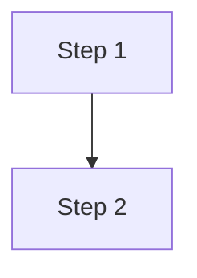

You are a senior DevOps engineer writing an operational runbook for a Docusaurus v3 portal.

## Task
Generate a Deploy Runbook document based on the project's CI/CD workflows, Makefile, and deployment configuration.

## CI/CD Workflows
${workflows_content}

## Makefile
${makefile_content}

## Existing Runbook (if any)
${existing_doc}

## Output Requirements
1. Output ONLY valid Markdown
2. Start with this exact YAML frontmatter block:
---
id: deploy
title: Deploy Runbook
sidebar_label: Deploy
sidebar_position: 1
description: "Step-by-step deployment procedure and rollback instructions."
keywords: [deploy, runbook, CI/CD, rollback, operations]
---

3. Include a Mermaid flowchart showing the deployment pipeline:

4. Cover these sections:
   - Prerequisites
   - Automated deployment flow (from CI/CD workflows)
   - Manual deployment steps
   - Release procedure (git tag)
   - Rollback procedure
   - Troubleshooting
   - Post-deployment verification

5. Use Docusaurus admonitions:
:::danger for rollback procedures and destructive operations
:::warning for prerequisites and common pitfalls
:::tip for time estimates and shortcuts

6. Include command examples with titles

7. End with a "Veja tambem" section

8. Write in ${doc_language}
9. If an existing doc was provided, preserve its structure and enhance it
